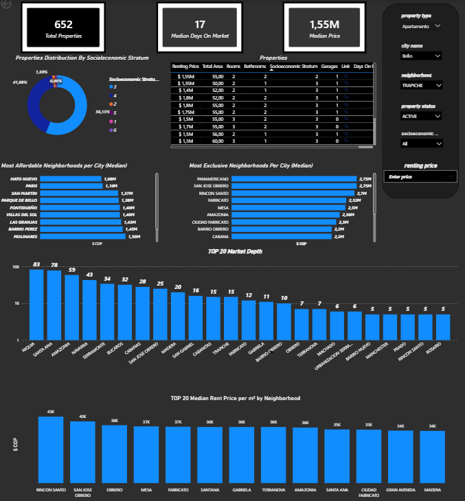
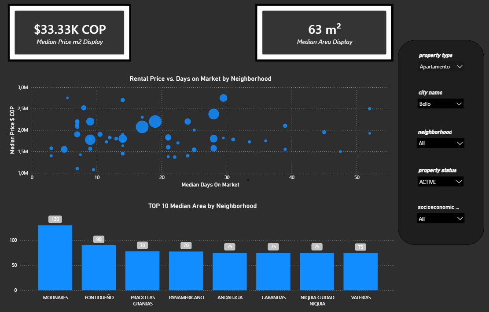

# Real Estate Data Pipeline & Analytics (Medallion Architecture)

## 🎯 Business Context & Project Value

🌐 **Language / Idioma:** **English** | [Español](README_ES.md)

### Project Overview
This project extracts rental listing data from a private API endpoint at **Metrocuadrado**, gathering rich real estate features across **17 major cities in Colombia**. 

The real estate rental market is fragmented, unstructured, and rapidly changing. Rental portals contain thousands of listings with inconsistent property descriptions, unstandardized location names (e.g., misspelled neighborhoods), duplicate listings, and volatile pricing. 

Without a centralized, cleaned, and structured data pipeline:
* **Real estate investors & agencies** struggle to benchmark fair market rental prices per square meter ($/m²$).
* **Analysts** waste hours manually cleaning raw export files instead of generating market insights.
* **Property managers** lack historical visibility to track price trends, vacancy risks, and demand variations across different city zones.

### The Solution & Business Impact
This project automates the entire lifecycle of real estate market intelligence:
1. **Automated Ingestion**: Scrapes real-time listings to track price adjustments, new market inventory, and property characteristics via API requests.
2. **Data Standardization & Deduplication**: Cleans messy spatial data using fuzzy string matching (`RapidFuzz`) and structures raw payloads into an analytics-ready **Star Schema** (Medallion Architecture).
3. **Data Trustability**: Enforces automated data quality contracts at the Silver layer via `dbt test` and custom macros to ensure invalid data or null key identifiers never corrupt downstream reporting.
4. **Actionable Insights**: Delivers a ready-to-query Data Warehouse (`DuckDB`) feeding an interactive **Power BI Dashboard** that enables stakeholders to analyze:
   * **Market Liquidity & Exposure (Days on Market)**: Evaluates listing velocity via *Median Days on Market* vs. *Rental Price*, identifying underpriced opportunities or stagnant high-premium properties.
   * **Granular Price Standardization ($/m²$)**: Benchmarks real estate value using *Median Rent Price per m²* across neighborhoods.
   * **Socioeconomic Stratum Profiling**: Maps supply distribution across socioeconomic strata (Estratos 1–6), pinpointing where middle-to-high income rental inventory is concentrated.
   * **Supply Depth & Market Concentration**: Features a *Top 20 Market Depth* distribution (ranking high-inventory zones like *Niquía* and *Santa Ana*) to assess neighborhood supply saturation.
   * **Pricing Polarization & Affordability**: Ranks *Most Affordable* vs. *Most Exclusive* neighborhoods per city based on median rental rates.
   * **Property Size & Layout Analysis**: Tracks *Median Area ($m²$)* and structural features (bedrooms, bathrooms, parking spaces) across top locations.

---

## 📐 System Architecture & Workflow Breakdown

---
config:
  layout: elk
---
flowchart TD
    %% Node Styles
    classDef external fill:#f9f9f9,stroke:#333,stroke-width:1px;
    classDef docker fill:#eef7ff,stroke:#1D63ED,stroke-width:2px;
    classDef dbt fill:#fff3e6,stroke:#FF6B00,stroke-width:1px;
    classDef output fill:#e6ffe6,stroke:#009933,stroke-width:2px;
    classDef pbi fill:#fff2cc,stroke:#d6b656,stroke-width:2px;

    subgraph Source["1. Ingestion & Web Scraping"]
        direction LR
        A["Metrocuadrado / Real Estate Portal API"]:::external
        B["Raw Parquet Files (Bronze/)"]:::external
        A -->|"Python Scraper"| B
    end

    subgraph DockerEnv["2. Isolated Processing Environment (Docker Desktop)"]
        direction TB

        subgraph Pipeline["data-pipeline Service (Python 3.11)"]
            direction TB

            subgraph DBT_Layer["Data Transformation & Star Schema (dbt + DuckDB)"]
                direction LR
                C["Staging Layer<br/>main_staging.staging_renting"]:::dbt
                D["Silver Layer<br/>main_intermediate.silver"]:::dbt
                E["Gold Layer - Fact Table<br/>main_mart.fact_renting"]:::dbt

                subgraph Dimensions["Dimensions"]
                    direction TB
                    F1["main_mart.dim_geo"]:::dbt
                    F2["main_mart.dim_feature"]:::dbt
                    F3["main_mart.dim_date"]:::dbt
                end

                G{"Data Quality Checks<br/>(schema.yml + integer_checking)"}:::dbt

                B -->|"read_parquet"| C
                C -->|"dbt run / RapidFuzz"| D
                D -->|"dbt test"| G
                D -->|"dbt run"| E
                D -->|"Dimensions"| F1
                D -->|"Dimensions"| F2
                D -->|"Dimensions"| F3
                F1 --> E
                F2 --> E
                F3 --> E
            end

            DB[("dev.duckdb<br/>Data Warehouse")]:::output

            E --> DB
            F1 --> DB
            F2 --> DB
            F3 --> DB
        end
    end

    subgraph Downstream["3. Visualization & CI/CD"]
        direction LR

        subgraph PowerBI["Power BI Dashboard"]
            direction TB
            H["Real Estate Analytics Dashboard"]:::pbi
            H1["Core Business KPIs:<br/>Total Properties, Median Price, Median Price/m², Median Area, Median Days on Market"]:::pbi
            H2["Market Dynamics & Ranks:<br/>Price vs. Days on Market, Market Depth, Affordable/Exclusive Neighborhoods"]:::pbi
            H3["Segmentations & Slicers:<br/>Property Type, City, Neighborhood, Stratum, Price & Status"]:::pbi

            H --> H1
            H --> H2
            H --> H3
        end

        I["GitHub Actions (CI/CD)"]:::external
        J["Ruff (Linting) & dbt test (Validation)"]:::external

        DB -->|"DuckDB Connector"| H
        I -->|"Automated Triggers"| J
        J -.-> DockerEnv
    end

    class DockerEnv docker;

1. Data Ingestion & Raw Layer (Bronze):

Private API Extraction (Python 3.11): Extracts real-time rental listings from Metrocuadrado's internal API. Scripts manage pagination, payload parsing, and robust exception handling. Two distinct execution modes were developed:

  * Incremental Load: Fetches newly added rental listings starting from page 1 to capture ongoing market updates.

  * Full Load: Extracts complete historical data based on total entry counts.

Storage Format (Parquet): Raw payloads are serialized into columnar .parquet files inside Renting_pipeline/bronze/. Parquet minimizes disk footprint, preserves native data types, and enables DuckDB to execute ultra-fast batch scans.

2. Isolated Processing Environment (Docker & dbt)
The core processing is isolated within a single Docker service (data-pipeline) running Python 3.11 and dbt-duckdb.

Medallion Transformations (dbt + DuckDB):

  - Staging Layer (main_staging.staging_renting):
    Reads Parquet files directly using DuckDB's read_parquet() function. Enforces schema casting, explicit type definitions, and standardizes column naming conventions.

  - Silver (main_intermediate.silver):
    Handles data enrichment, filtering out incomplete payloads, deduplication, and string standardization. Uses string matching techniques (RapidFuzz) to group variant neighborhood spellings into canonical location categories.

  - Gold Layer (main_mart - Star Schema):
    Models clean data into an OLAP-optimized Star Schema utilizing Hexadecimal Surrogate Keys:

       - fact_renting: Central fact table storing measurable metrics (rental price, total area, days on market, days off market, administration fees).

       - dim_geo: Location dimension (city, zone, standardized neighborhood).

       - dim_feature: Property features dimension (bedrooms, bathrooms, garages, socioeconomic stratum).

       - dim_date: Time dimension for trend and time-series analysis.

Data Quality Checks:
  
   * dbt Testing & Custom Validation Macros: Data quality contracts are enforced directly at the **Silver Layer** within the `schema.yml` configuration file.
   * Custom Testing Macro (`integer_checking`): In addition to standard schema validations, the pipeline utilizes a custom macro located in the `macros/` folder (`integer_checking.sql`) to validate numeric integrity and ensure integer constraints across key columns before data moves into the Gold Layer.
   * Data Reliability Contracts: Validates primary keys (`unique`, `not_null`) and field formats early in the Silver model, preventing corrupted or malformed data from reaching the analytical Star Schema in the Gold Layer.

3. Analytics & CI/CD:

   * Data Warehouse (dev.duckdb): Persists transformed tables inside an embedded DuckDB database file, acting as a lightweight, fast local Data Warehouse.

   * Power BI Layer: Connects directly to dev.duckdb via DuckDB's ODBC connector to power real-time market dashboards.

   * CI/CD Automation: GitHub Actions triggers workflows on code commits to run code formatting tests (Ruff) and data integrity checks (dbt test) automatically.


## 🚀 Quickstart & Execution Guide

### Prerequisites
* [Docker Desktop](https://www.docker.com/products/docker-desktop/) installed and running.
* [Git](https://git-scm.com/) installed.
* [Power BI Desktop](https://powerbi.microsoft.com/) (optional, for dashboard customization).
* [DuckDB ODBC Driver](https://duckdb.org/docs/archive/0.9.2/api/odbc/windows.html) (required only if connecting Power BI locally).

---

### 1. Repository Setup
Clone the repository and navigate into the project root directory:

```bash
git clone [https://github.com/your-username/real-estate-data-pipeline.git](https://github.com/your-username/real-estate-data-pipeline.git)
cd real-estate-data-pipeline   

2. Environment Configuration
Create a .env file in the root directory by copying the provided .env.example template:

 - Bash:
   * cp .env.example .env

 - Open the .env file and populate it with your specific Metrocuadrado API key and User-Agent headers:

   * API_KEY = API_KEY_HERE
   * AGENT = AGENT_HERE

### 3. Running the Pipeline with Docker

The entire ingestion, transformation, and testing workflow runs inside an isolated Docker container.

#### Option A: Full Pipeline Execution (Scrape + dbt Run + dbt Test)
Build and run the containerized pipeline end-to-end:

```bash
docker compose up --build
```

#### Option B: Step-by-Step Manual Execution
If you prefer running specific stages individually using Docker container execution:

1. **Build the Container Image**:
   ```bash
   docker compose build
   ```

2. **Run Web Scraping / API Ingestion (Bronze Layer)**:
   ```bash
   # Run Incremental Extraction (latest page listings)
   docker compose run --rm data-pipeline python scraper/Renting_project_INCREMENTAL_LOAD.py  --mode incremental

   # Run Full Load Extraction (all available listings)
   docker compose run --rm data-pipeline python scraper/Renting_project_FULL_LOAD.py --mode full
   ```

3. **Execute dbt Transformations (Staging -> Silver -> Gold)**:
   ```bash
   docker compose run --rm data-pipeline dbt run --profiles-dir .
   ```

4. **Execute Data Quality Checks (`schema.yml` + `integer_checking` Macro)**:
   ```bash
   docker compose run --rm data-pipeline dbt test --profiles-dir .
   ```

---

### 4. Code Formatting & Linting (CI/CD Local Validation)
Before pushing changes, run code quality checks via `Ruff` to ensure compliance with repository style rules:

```bash
# Run Linter
docker compose run --rm data-pipeline ruff check .

# Run Code Auto-formatter
docker compose run --rm data-pipeline ruff format .
```

---

### 5. Accessing Transformed Data & Power BI

1. **Embedded Data Warehouse**:
   Once the pipeline completes, the clean Star Schema dataset will be persisted inside `transformations_dbt/dev.duckdb`.

2. **Connecting Power BI**:
   * Open the provided `.pbix` file located in `Renting_pipeline/reports/real_estate_analytics.pbix`.
   * Ensure the DuckDB ODBC driver is installed on your local system.
   * Update the ODBC connection parameters in Power BI to point to your local `dev.duckdb` file path.

---

## 🛠 Tech Stack & Tools

| Domain | Technology / Tool | Usage & Purpose |
| :--- | :--- | :--- |
| **Language & Core** | **Python 3.11** | Orchestration, web scraping/API extraction, data parsing, and string matching. |
| **Ingestion** | **Requests** | Automated HTTP requests to internal private APIs, handling pagination and retries. |
| **Data Storage** | **Apache Parquet** | Columnar file storage for raw data (Bronze Layer) optimizing disk I/O and compression. |
| **Data Warehouse** | **DuckDB** | In-process OLAP database used as the central analytical Data Warehouse (`dev.duckdb`). |
| **Transformation** | **dbt-duckdb** | SQL transformations, schema management, and dimensional modeling (Star Schema). |
| **Fuzzy Matching** | **RapidFuzz** | String distance algorithm for neighborhood and location name standardization. |
| **Data Testing** | **dbt tests & Custom Macros** | Schema validation in Silver layer using `schema.yml` and custom macro `integer_checking.sql`. |
| **Containerization** | **Docker & Docker Compose** | Complete environment isolation, dependency management, and reproducible execution. |
| **Code Quality** | **Ruff** | Lightning-fast Python linter and code formatter ensuring PEP 8 compliance. |
| **CI/CD** | **GitHub Actions** | Automated integration pipelines for continuous testing (`dbt test`) and code linting (`Ruff`). |
| **Visualization** | **Power BI** | Executive analytics dashboard connected to DuckDB via ODBC driver. |

---

## 📂 Project Structure

```text
REAL_STATE_PROJECT/
├── Renting_pipeline/
    ├── bronze/                                # Data storage directory (Bronze Parquet files & dev.duckdb Data Warehouse)
├── scraper/                                   # Python scripts for private API extraction (Incremental & Full load) 
    ├── Renting_project_FULL_LOAD.py
    ├── Renting_project_INCREMENTAL_LOAD.py   
├── transformations_dbt/                      # dbt project directory
│   ├── macros/                               # Custom dbt macros (e.g., integer_checking.sql)
│   ├── models/                               # Medallion models (Staging, Intermediate/Silver, Marts/Gold)
│   ├── dbt_project.yml                       # dbt project configuration
│   └── schema.yml                            # Data quality tests & column schema definitions
├── .gitignore                                # Git ignore patterns
├── .user.yml                                 # dbt user local config
├── docker-compose.yml                        # Multi-container orchestration specification
├── Dockerfile                                # Docker image definition for data-pipeline environment
├── Full_ingestion.log                        # Execution logs for full historical API ingestion
├── Incremental_ingestion.log                 # Execution logs for incremental daily API ingestion
├── profiles.yml                              # dbt target connection parameters (DuckDB setup)
├── pyproject.toml                            # Tool configuration (e.g., Ruff linter settings)
├── README.md                                 # Project documentation
├── real_state_analytics.pbix                                          
└── requirements.txt                          # Python environment dependencies
```

---

## 📊 Interactive Dashboard & Visual Analytics

The underlying DuckDB Data Warehouse powers an interactive **Power BI Dashboard**, translating raw property listings into actionable real estate intelligence.

### Page 1: Executive Market Overview & Liquidity
* **Key Metrics**: Highlights overall property counts, median pricing, and median time-on-market (*Days on Market*).
* **Strategic Insights**: Compares price distributions across socioeconomic strata, top market supply depth by zone, and price per $m²$ rankings.



---

### Page 2: Property Valuation & Structural Layout Analysis
* **Key Metrics**: Features median price per $m²$ and overall median property area ($m²$).
* **Strategic Insights**: Maps rental prices against listing velocity to identify market anomalies, along with top neighborhood layout comparisons.

