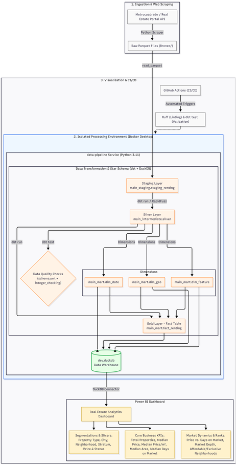

# Pipeline de Datos e Inteligencia Inmobiliaria (Arquitectura Medallón)

## 🎯 Contexto de Negocio y Valor del Proyecto

🌐 **Language / Idioma:** [English](README.md) | **Español**

### Visión General del Proyecto
Este proyecto extrae datos de ofertas de arriendo a través del endpoint de una API privada de **Metrocuadrado**, recopilando características inmobiliarias de **17 ciudades principales de Colombia**.

El mercado de arrendamiento inmobiliario está fragmentado, no estructurado y cambia rápidamente. Los portales inmobiliarios contienen miles de publicaciones con descripciones inconsistentes, nombres de ubicaciones no estandarizados (por ejemplo, barrios mal escritos), publicaciones duplicadas y precios volátiles.

Sin un pipeline de datos centralizado, limpio y estructurado:
* **Los inversionistas y agencias inmobiliarias** tienen dificultades para establecer precios de referencia justos de arriendo por metro cuadrado ($/m²$).
* **Los analistas** pierden horas limpiando manualmente archivos de exportación crudos en lugar de generar análisis de mercado.
* **Los administradores de propiedades** carecen de visibilidad histórica para rastrear tendencias de precios, riesgos de vacancia y variaciones de demanda entre diferentes zonas de la ciudad.

### La Solución e Impacto en el Negocio
Este proyecto automatiza todo el ciclo de vida de la inteligencia de mercado inmobiliario:
1. **Ingesta Automatizada**: Realiza web scraping/consultas API a publicaciones en tiempo real para rastrear ajustes de precios, nuevo inventario y características de los inmuebles.
2. **Estandarización de Datos y Deduplicación**: Limpia datos espaciales desordenados mediante coincidencia difusa de texto (`RapidFuzz`) y estructura los archivos crudos en un **Modelo Estrella (Star Schema)** listo para analítica (Arquitectura Medallón).
3. **Confiabilidad de los Datos**: Aplica contratos automáticos de calidad de datos en la capa Silver mediante `dbt test` y macros personalizadas para garantizar que datos no válidos o llaves nulas nunca corrompan los reportes finales.
4. **Información Accionable**: Entrega un Data Warehouse en **DuckDB** listo para consultar que alimenta un **Dashboard Interactivo en Power BI**, permitiendo a los interesados analizar:
   * **Liquidez y Exposición del Mercado (Días en Mercado)**: Evalúa la velocidad de rotación mediante la *Mediana de Días en Mercado* frente al *Precio de Arriendo*, identificando propiedades subvaloradas o propiedades de alto valor estancadas.
   * **Estandarización Granular de Precios ($/m²$)**: Compara el valor inmobiliario utilizando el *Precio Mediano de Arriendo por m²* entre barrios.
   * **Perfilamiento por Estrato Socioeconómico**: Mapea la distribución de la oferta entre estratos socioeconómicos (Estratos 1–6), identificando dónde se concentra el inventario de arriendo para ingresos medios y altos.
   * **Profundidad de la Oferta y Concentración del Mercado**: Presenta una distribución del *Top 20 de Profundidad de Mercado* (clasificando zonas de alto inventario como *Niquía* y *Santa Ana*) para evaluar la saturación de la oferta por barrio.
   * **Polarización de Precios y Asequibilidad**: Clasifica los barrios *Más Asequibles* vs. *Más Exclusivos* por ciudad según las tarifas medianas de arriendo.
   * **Tamaño del Inmueble y Análisis de Distribución**: Rastrea la *Área Mediana ($m²$)* y características estructurales (habitaciones, baños, parqueaderos) en las principales ubicaciones.

---

## 📐 Arquitectura del Sistema y Flujo de Trabajo



### 1. Ingesta de Datos y Capa Cruda (Bronze)

* **Extracción desde API Privada (`Python 3.11`)**: Extrae ofertas de arriendo en tiempo real desde la API interna de Metrocuadrado. Los scripts gestionan la paginación, el procesamiento de payloads y un manejo sólido de excepciones. Se desarrollaron dos modos de ejecución:
  * **Carga Incremental**: Extrae ofertas recién agregadas comenzando desde la página 1 para capturar actualizaciones continuas del mercado.
  * **Carga Completa (Full Load)**: Extrae datos históricos completos según el conteo total de entradas.

* **Formato de Almacenamiento (`Parquet`)**: Los datos crudos se serializan en archivos columnares `.parquet` dentro de `Renting_pipeline/bronze/`. El formato Parquet minimiza el espacio en disco, preserva los tipos de datos nativos y permite a DuckDB ejecutar lecturas masivas a alta velocidad.

---

### 2. Entorno de Procesamiento Aislado (Docker y dbt)
El procesamiento principal está aislado dentro de un único servicio de Docker (`data-pipeline`) ejecutando Python 3.11 y `dbt-duckdb`.

#### Transformaciones Medallón (dbt + DuckDB)

* **Capa Staging (`main_staging.staging_renting`)**:
  Lee archivos Parquet directamente usando la función `read_parquet()` de DuckDB. Aplica casteo de esquemas, definiciones explícitas de tipos y estandariza las convenciones de nombres de columnas.

* **Capa Silver (`main_intermediate.silver`)**:
  Maneja el enriquecimiento de datos, filtrado de payloads incompletos, deduplicación y estandarización de texto. Utiliza técnicas de coincidencia difusa (`RapidFuzz`) para agrupar variaciones en la escritura de los barrios dentro de categorías de ubicación canónicas.

* **Capa Gold (`main_mart` - Modelo Estrella)**:
  Modela los datos limpios en un Modelo Estrella optimizado para OLAP utilizando Llaves Subrogadas Hexadecimales:
  * **`fact_renting`**: Tabla de hechos central que almacena métricas medibles (precio de arriendo, área total, días en mercado, días fuera de mercado, costo de administración).
  * **`dim_geo`**: Dimensión de ubicación (ciudad, zona, barrio estandarizado).
  * **`dim_feature`**: Dimensión de características del inmueble (habitaciones, baños, parqueaderos, estrato socioeconómico).
  * **`dim_date`**: Dimensión de tiempo para análisis de tendencias y series temporales.

#### Pruebas de Calidad de Datos

* **Pruebas dbt en Capa Silver**: Los contratos de calidad de datos se aplican directamente en la **Capa Silver** dentro del archivo de configuración `schema.yml`.
* **Macro de Validación Personalizada (`integer_checking`)**: Además de las validaciones de esquema estándar, el pipeline utiliza una macro personalizada ubicada en la carpeta `macros/` (`integer_checking.sql`) para validar la integridad numérica y garantizar restricciones de enteros en columnas clave antes de mover los datos a la Capa Gold.
* **Contratos de Confiabilidad de Datos**: Valida llaves primarias (`unique`, `not_null`) y formatos de campo de manera temprana en el modelo Silver, evitando que datos corruptos o malformados lleguen al Modelo Estrella analítico en la Capa Gold.

---

### 3. Analítica y CI/CD

* **Data Warehouse (`dev.duckdb`)**: Persiste las tablas transformadas dentro de un archivo de base de datos embebido en DuckDB, actuando como un Data Warehouse local, ligero y rápido.
* **Capa de Power BI**: Se conecta directamente a `dev.duckdb` a través del conector ODBC de DuckDB para alimentar tableros de control de mercado en tiempo real.
* **Automatización CI/CD**: **GitHub Actions** dispara flujos de trabajo con cada commit para ejecutar pruebas de formato de código (`Ruff`) y verificaciones de integridad de datos (`dbt test`) automáticamente.

---

## 🚀 Guía de Inicio Rápido y Ejecución

### Requisitos Previos
* [Docker Desktop](https://www.docker.com/products/docker-desktop/) instalado y ejecutándose.
* [Git](https://git-scm.com/) instalado.
* [Power BI Desktop](https://powerbi.microsoft.com/) (opcional, para personalización de tableros).
* [Controlador ODBC de DuckDB](https://duckdb.org/docs/archive/0.9.2/api/odbc/windows.html) (requerido solo si se conecta Power BI localmente).

---

### 1. Configuración del Repositorio
Clona el repositorio y navega al directorio raíz del proyecto:

```bash
git clone [https://github.com/tu-usuario/real-estate-data-pipeline.git](https://github.com/tu-usuario/real-estate-data-pipeline.git)
cd real-estate-data-pipeline   
```

---

### 2. Configuración del Entorno
Crea un archivo `.env` en el directorio raíz copiando la plantilla `.env.example` provista:

```bash
cp .env.example .env
```

Abre el archivo `.env` y completa tus credenciales específicas de la API de Metrocuadrado y encabezados User-Agent:

```env
API_KEY = TU_API_KEY_AQUI
AGENT = TU_USER_AGENT_AQUI
```

---

### 3. Ejecución del Pipeline con Docker

Todo el flujo de trabajo de ingesta, transformación y pruebas se ejecuta dentro de un contenedor Docker aislado.

#### Opción A: Ejecución Completa del Pipeline (Scraping + dbt Run + dbt Test)
Construye y ejecuta el pipeline contenedorizado de principio a fin:

```bash
docker compose up --build
```

#### Opción B: Ejecución Manual Paso a Paso
Si prefieres ejecutar etapas específicas individualmente dentro del contenedor Docker:

1. **Construir la Imagen del Contenedor**:
   ```bash
   docker compose build
   ```

2. **Ejecutar Web Scraping / Ingesta de API (Capa Bronze)**:
   ```bash
   # Ejecutar Extracción Incremental (últimas publicaciones)
   docker compose run --rm data-pipeline python scraper/Renting_project_INCREMENTAL_LOAD.py --mode incremental

   # Ejecutar Extracción de Carga Completa (todas las publicaciones disponibles)
   docker compose run --rm data-pipeline python scraper/Renting_project_FULL_LOAD.py --mode full
   ```

3. **Ejecutar Transformaciones de dbt (Staging -> Silver -> Gold)**:
   ```bash
   docker compose run --rm data-pipeline dbt run --profiles-dir .
   ```

4. **Ejecutar Pruebas de Calidad de Datos (`schema.yml` + Macro `integer_checking`)**:
   ```bash
   docker compose run --rm data-pipeline dbt test --profiles-dir .
   ```

---

### 4. Formateo de Código y Linting (Validación Local para CI/CD)
Antes de subir cambios, ejecuta las validaciones de calidad de código mediante `Ruff` para asegurar el cumplimiento de las reglas de estilo del repositorio:

```bash
# Ejecutar Linter
docker compose run --rm data-pipeline ruff check .

# Ejecutar Formateador Automático de Código
docker compose run --rm data-pipeline ruff format .
```

---

### 5. Acceso a Datos Transformados y Power BI

1. **Data Warehouse Embebido**:
   Una vez completado el pipeline, el conjunto de datos limpio bajo el Modelo Estrella persistirá dentro de `transformations_dbt/dev.duckdb`.

2. **Conexión con Power BI**:
   * Abre el archivo `.pbix` provisto ubicado en `Renting_pipeline/reports/real_estate_analytics.pbix`.
   * Asegúrate de tener instalado el controlador ODBC de DuckDB en tu sistema local.
   * Actualiza los parámetros de conexión ODBC en Power BI para apuntar a la ruta local de tu archivo `dev.duckdb`.

---

## 🛠 Tecnologías y Herramientas

| Dominio | Tecnología / Herramienta | Uso y Propósito |
| :--- | :--- | :--- |
| **Lenguaje Principal** | **Python 3.11** | Orquestación, extracción de API/web scraping, parseo de datos y coincidencia de texto. |
| **Ingesta** | **Requests** | Peticiones HTTP automatizadas a APIs privadas internas, gestionando paginación y reintentos. |
| **Almacenamiento** | **Apache Parquet** | Almacenamiento columnar para datos crudos (Capa Bronze) optimizando la compresión e E/S de disco. |
| **Data Warehouse** | **DuckDB** | Base de datos OLAP embebida utilizada como Data Warehouse analítico central (`dev.duckdb`). |
| **Transformación** | **dbt-duckdb** | Transformaciones SQL, gestión de esquemas y modelado dimensional (Modelo Estrella). |
| **Coincidencia Difusa** | **RapidFuzz** | Algoritmo de distancia de texto para estandarizar nombres de barrios y ubicaciones. |
| **Pruebas de Datos** | **Pruebas dbt y Macros** | Validación de esquemas en Capa Silver con `schema.yml` y macro personalizada `integer_checking.sql`. |
| **Contenedores** | **Docker & Docker Compose** | Aislamiento completo del entorno, gestión de dependencias y ejecución reproducible. |
| **Calidad de Código** | **Ruff** | Linter y formateador de código Python ultrarrápido que garantiza el cumplimiento de PEP 8. |
| **CI/CD** | **GitHub Actions** | Pipelines de integración continua para automatizar pruebas (`dbt test`) y linting (`Ruff`). |
| **Visualización** | **Power BI** | Dashboard analítico interactivo conectado a DuckDB mediante controlador ODBC. |

---

## 📂 Estructura del Proyecto

```text
REAL_STATE_PROJECT/
├── Renting_pipeline/
│   └── bronze/                                # Almacenamiento de datos (Archivos Parquet Bronze)
├── scraper/                                   # Scripts en Python para extracción de API (Cargas Incremental y Completa)
│   ├── Renting_project_FULL_LOAD.py
│   └── Renting_project_INCREMENTAL_LOAD.py   
├── transformations_dbt/                      # Directorio del proyecto dbt
│   ├── macros/                               # Macros personalizadas de dbt (ej. integer_checking.sql)
│   ├── models/                               # Modelos Medallón (Staging, Intermediate/Silver, Marts/Gold)
│   ├── dbt_project.yml                       # Configuración del proyecto dbt
│   └── schema.yml                            # Definición de pruebas de calidad y esquemas de columnas
├── .gitignore                                # Patrones ignorados por Git
├── .user.yml                                 # Configuración local del usuario dbt
├── docker-compose.yml                        # Especificación de orquestación de contenedores
├── Dockerfile                                # Definición de la imagen Docker para el entorno data-pipeline
├── Full_ingestion.log                        # Registros de ejecución de la ingesta histórica completa
├── Incremental_ingestion.log                 # Registros de ejecución de la ingesta diaria incremental
├── profiles.yml                              # Configuración de conexión objetivo en dbt (DuckDB)
├── pyproject.toml                            # Configuración de herramientas (ej. parámetros del linter Ruff)
├── real_state_analytics.pbix  
├── README.md                                 # Documentación principal del proyecto (Inglés)
└── requirements.txt                          # Dependencias del entorno Python
```

---

## 📊 Dashboard Interactivo y Analítica Visual

El Data Warehouse subyacente en DuckDB alimenta un **Dashboard interactivo en Power BI**, traduciendo las publicaciones de propiedades crudas en inteligencia inmobiliaria accionable.

### Página 1: Resumen Ejecutivo del Mercado y Liquidez
* **Métricas Clave**: Destaca el conteo total de propiedades, precio mediano y tiempo mediano en el mercado (*Días en Mercado*).
* **Análisis Estratégico**: Compara distribuciones de precios por estrato socioeconómico, profundidad de la oferta de mercado por zona y rankings de precio por $m²$.


---

### Página 2: Valoración de Inmuebles y Análisis de Distribución Estructural
* **Métricas Clave**: Presenta el precio mediano por $m²$ y el área mediana total de los inmuebles ($m²$).
* **Análisis Estratégico**: Mapea los precios de arriendo frente a la velocidad de rotación para identificar anomalías del mercado, junto con comparaciones de distribución en los principales barrios.

